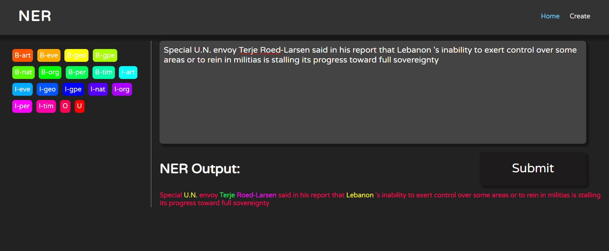

# Custom Trained NER using Bidirectional LSTM

## Introduction
This project showcases a custom Named Entity Recognition (NER) model using Bidirectional Long Short-Term Memory (BiLSTM) layers for precise entity predictions. The model is trained using a specific dataset and is integrated with a simple user interface built with HTML, CSS, and Flask.

## Features
- **Custom NER Model**: Utilizes Bidirectional LSTM layers for accurate predictions.
- **User Interface**: Simple dark-themed UI for inputting text and viewing NER outputs.
- **Pre-trained Model**: The project includes the pre-trained NER model, ready for use.

## Technologies Used
- TensorFlow
- Flask
- HTML & CSS

## Dataset
The model is trained using the NER dataset provided by [Raj Nath Patel on Kaggle](https://www.kaggle.com/datasets/rajnathpatel/ner-data).

## Project Motivation
The primary motivation for this project was to gain hands-on experience with machine learning and NER models, and to showcase these skills in a practical application.

## Data Preprocessing
The provided dataset was already well-preprocessed, so the primary task was to create a custom data pipeline for feeding the data into the model.

## Model Architecture
The NER model is built using a series of Bidirectional LSTM layers with dropout for regularization. Below is a table summarizing the model architecture:

| Layer          | Output Shape       | Additional Parameters                               |
|----------------|--------------------|-----------------------------------------------------|
| Input          | (None, maxLen)     | `maxLen` = 35                                       |
| Embedding      | (None, maxLen, 200)| `input_dim`=totalTokens, `output_dim`=200           |
| Bidirectional LSTM (LSTM1) | (None, maxLen, 256)| `units`=128, `return_sequences`=True, `recurrent_dropout`=0.1 |
| Bidirectional LSTM (LSTM2) | (None, maxLen, 256)| `units`=128, `return_sequences`=True, `recurrent_dropout`=0.1 |
| Bidirectional LSTM (LSTM3) | (None, maxLen, 256)| `units`=128, `return_sequences`=True, `recurrent_dropout`=0.1 |
| Dropout        | (None, maxLen, 256)| `rate`=0.5                                          |
| TimeDistributed Dense (Classifier) | (None, maxLen, numClasses)| `units`=numClasses, `activation`="softmax" |

## Training Process
The model was trained for 10 epochs, which took approximately 15 minutes on the available hardware.

## Evaluation Metrics
The model achieved a validation accuracy of 97.47%.

## User Interface
The UI features a text input area for entering sentences and an output area for displaying the NER results. The labels are color-coded for easy identification of different entity types.



## Prerequisites
- TensorFlow

## Installation and Setup
1. Clone the repository:
    ```sh
    git clone https://github.com/ivanrj7j/NER-BiLSTM
    ```
2. Install the required packages:
    ```sh
    pip install -r requirements.txt
    ```
3. Navigate to the interface folder:
    ```sh
    cd interface
    ```
4. Run the application:
    ```sh
    python main.py
    ```

## Usage
- Open a browser and go to `http://127.0.0.1:5000/`.
- Enter text in the input area and click the "Submit" button.
- View the NER results in the output area.

## Known Issues
- The model can only process up to 35 tokens at once, which may result in loss of context during prediction.

## Acknowledgments
- [Raj Nath Patel](https://www.kaggle.com/rajnathpatel) for the dataset.

## License
This project is licensed under the MIT License.

## Contact
For any questions or suggestions, feel free to contact me at:
- **Email**: ivanrj7j@gmail.com
- **GitHub**: [ivanrj7j](https://github.com/ivanrj7j)

---

Feel free to make any adjustments or let me know if there's anything more you'd like to add.